# 시연 시나리오

### 시청자

#### 로그인

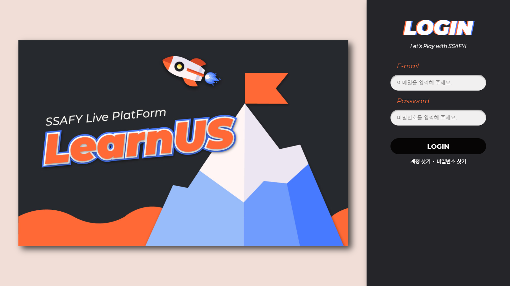

- 로그인 기능(이메일, 비밀번호 입력)
- 계정 찾기 기능(학번, 전화번호 입력)
- 비밀번호 찾기(이메일, 학번, 전화번호 입력)
    - 성공 시, 비밀번호 리셋 페이지로 이동, 새 비밀번호 설정(비밀번호, 비밀번호 확인 입력)
    

#### 인덱스

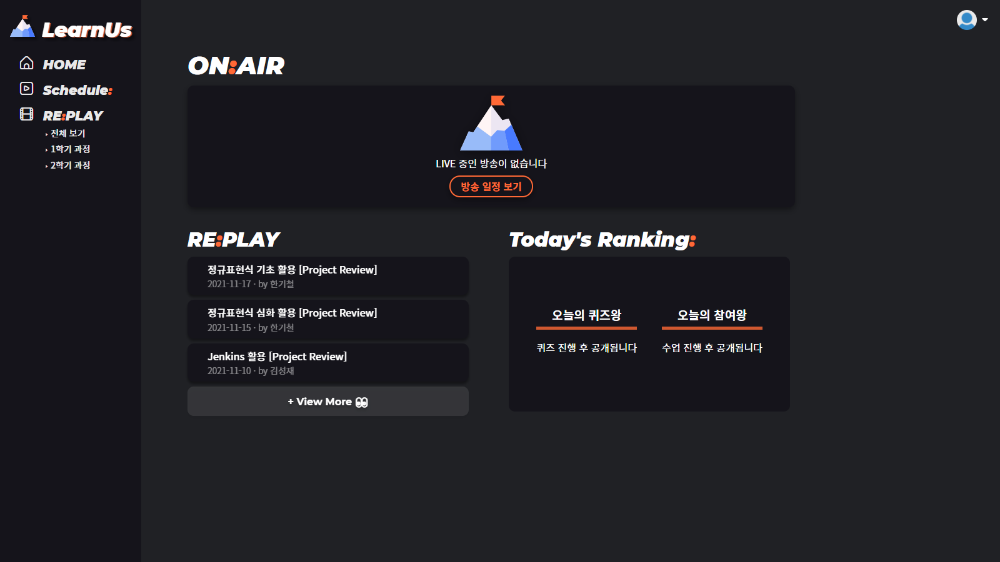

- ONAIR (현재 방송중인 방송 목록 표시, 현재 진행중인 방송 없을 시 방송 일정으로 연결)
- REPLAY(자신이 소속된 트랙의 다시보기 최근 3개 항목 표시, 다시보기로 연결)
- TODAY'S RANKING(LearnUs 사용자 중 퀴즈 점수와 채팅 점수를 기준으로 당일 상위 3명의 이름 표시)
- SIDEBAR(홈, 방송스케줄, 다시보기 목록에 접근)

#### 라이브 방송 페이지

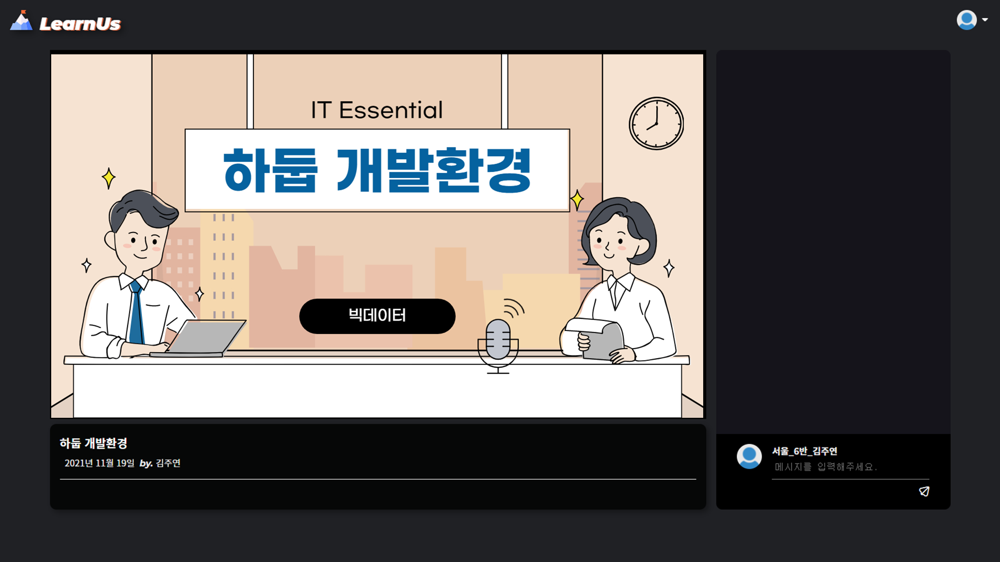

- 라이브 스트리밍(좌측, 썸네일 클릭 시 스트리밍 영상 재생)
- 방송정보(좌측 하단, 방송 제목, 방송 시작일, 방송 진행자 및 방송 설명 표시)
- 채팅(우측, 실시간 채팅 기능 및 실시간 퀴즈 풀이, 출석체크 기능)

#### 다시보기 페이지

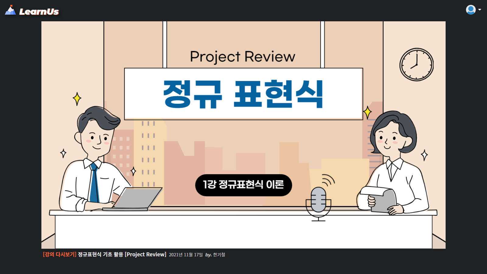

- 다시보기 영상(썸네일 클릭 시 다시보기 영상 재생)
- 방송정보(방송 제목, 방송 시작일, 방송 진행자 및 방송 설명 표시)

#### REPLAY

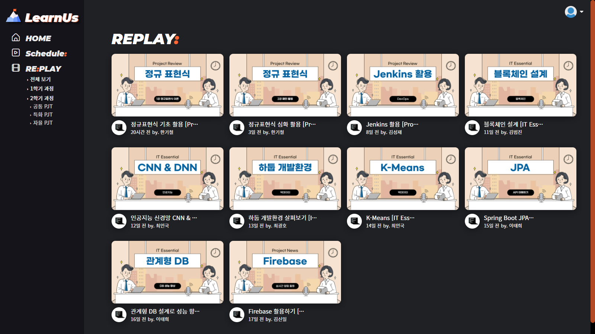

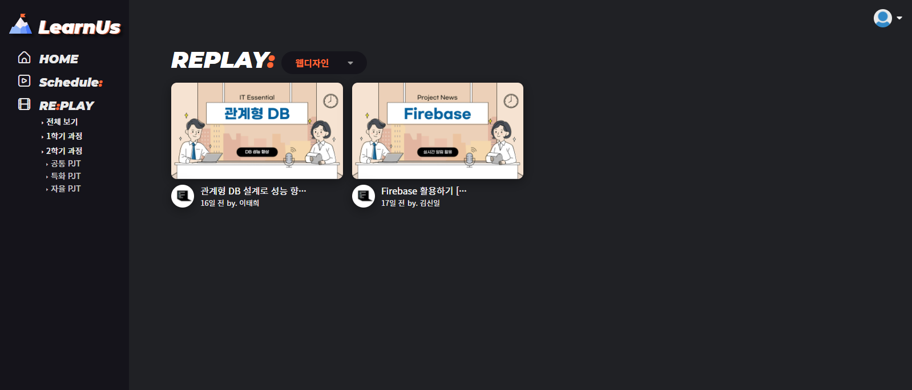

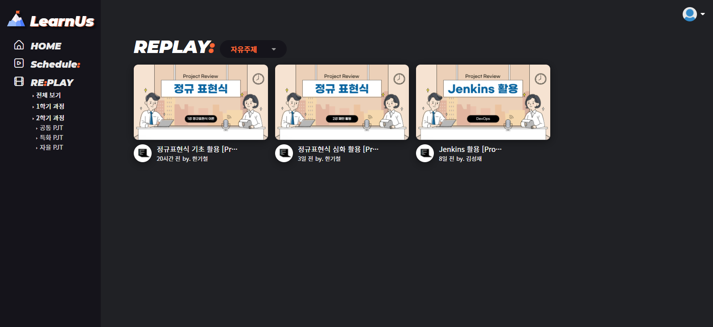

- 교육생과 관련된 강의 영상 전체보기
- 1학기, 2학기 학기별 영상 분류
    - 트랙별 강의 영상 리스트
    

#### MY:PROFILE

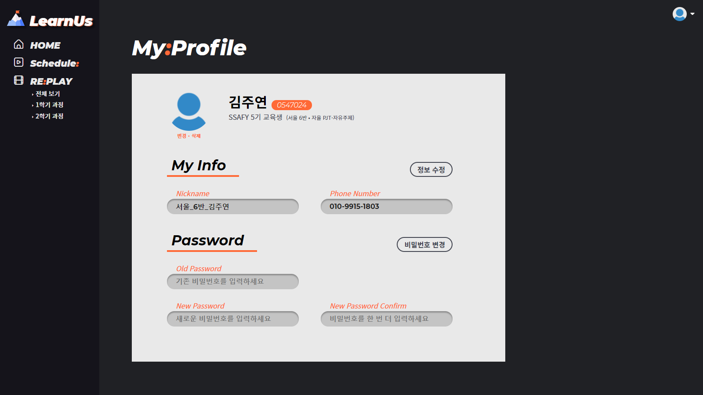

- 정보 수정 (현재 번호와 다른 번호 입력 시 정보 수정 버튼 활성화)
- 비밀번호 변경 (현재 비밀번호 및 새로운 비밀번호 입력 시 비밀번호 변경 버튼 활성화)

### 관리자

#### 라이브 생성 페이지

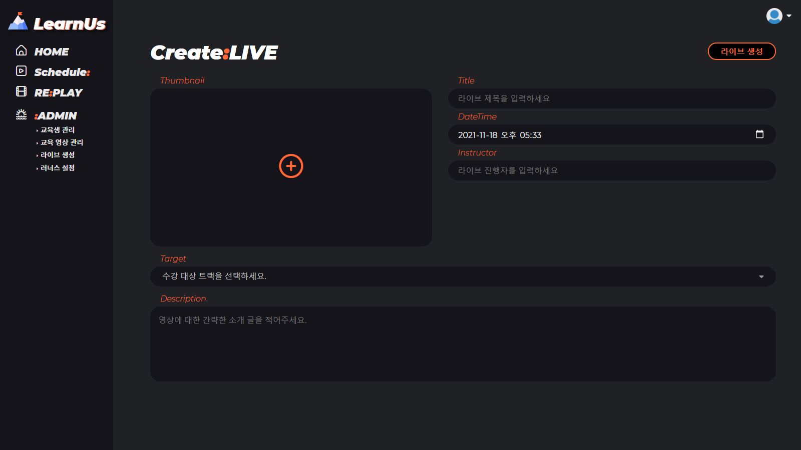

- Thumbnail(`+` 버튼 통해 jpg, jpeg, png 파일 썸네일로 등록)
- Title(필수, 방송 제목 입력)
- DateTime(필수, 방송 시작일 입력)
- Instructor(필수, 방송 진행자 입력)
- Target(필수, 방송 대상 트랙 선택)
- Description(영상에 대한 간략한 소개)

#### 스케줄 페이지

- 계획된 방송을 날짜순으로 노출
- 카드 클릭을 통해 방송 페이지로 이동
- `방송 관리 스튜디오` 버튼을 통해 방송 관리 스튜디오로 이동
- `방송 취소` 버튼을 누르면 나오는 방송 취소 팝업을 통해 방송 스케줄 삭제

#### 방송 관리 스튜디오

- 출석체크 시작 (최상단 우측, 대상 교육생들의 실시간 출석체크 시작)
    - 출석체크 종료(실시간 출석체크 마감)
    - 출석체크 재시작(실시간 출석체크 재시작)
- 방송 시작 (최상단 우측, 방송 시작)
    - 방송 종료 (방송 결과 확인 및 방송 공개 여부, 기프티콘 명단 및 미참석 명단 MM 발송 여부 결정)
- 방송정보 수정(중앙 상단, 방송 정보 수정 팝업 표시, 방송 생성과 동일)
- 교육생 관리(중앙 하단 첫번째 탭, 교육생 명단 및 출석 여부 확인)
- 퀴즈 관리(중앙 하단 두번째 탭, 퀴즈 목록 확인 및 퀴즈 생성, 출제, 상제)
- 기프티콘(중앙 하단 세번째 탭, 기프티콘 명단 확인 및 교육생 검색과 기프티콘 부여, 삭제 기능)
- 채팅(우측, 실시간 채팅 기능 및 실시간 퀴즈 풀이, 출석체크 기능)

#### ADMIN: 교육 영상 관리 List 페이지

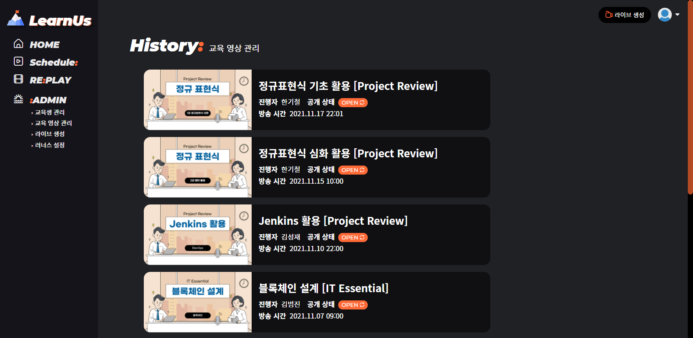

- 종료된 방송의 리스트 확인, 카드 클릭 시 교육 영상 관리 Detail  페이지로 이동
- 각 카드의 `OPEN`, `CLOSE` 버튼을 통해 다시보기 영상 공개, 비공개 설정

#### ADMIN: 교육 영상 관리 Detail 페이지

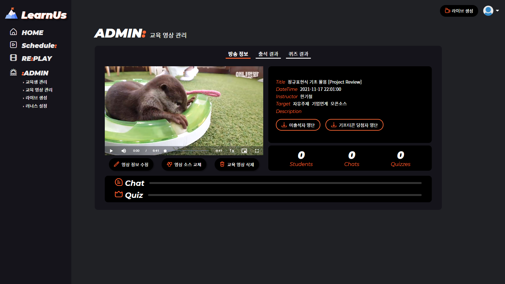

- 방송 정보 탭
    - 영상 정보 수정(좌측, 영상 정보 수정 팝업 표시)
    - 영상 소스 교체(좌측, 다시보기에서 보여줄 영상 소스 업로드)
    - 교육 영상 삭제(좌측, 영상 정보 및 다시보기 영상 삭제)
    - 미출석자 명단, 기프티콘 당첨자 명단(우측, 해당 명단을 `.xlsx` 파일로 다운로드
    - Score(우측, 참석 학생 수, 채팅 수, 퀴즈 출제 수를 표시)
    - Award(하단, 채팅과 퀴즈 우수자 3명까지 표시)
- 출석 결과 탭
    - 반별 교육생 명단과 출석 여부 확인
- 퀴즈 결과 탭
    - 퀴즈 목록과 퀴즈 진행 결과 우수자 확인
    

#### ADMIN: 교육생 관리 

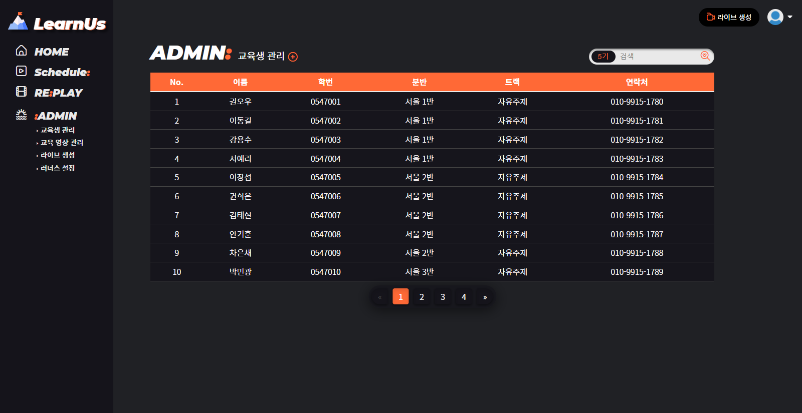

- 교육생 관리 `+` (좌측 상단, 교육생 명단을 `.xlsx` 파일로 등록 가능,
- 검색(우측 상단, 기수를 선택 후 교육생 이름을 입력하여 교육생 검색)
- 표(해당 교육생 선택 시 교육생 정보 수정 탭 표시)

#### ADMIN: 러너스 설정

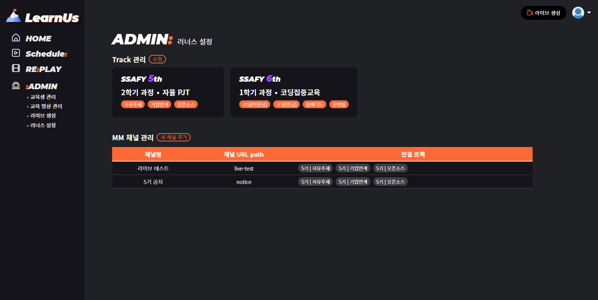

- Track 관리
    - `수정`(현재 진행중인 교육 과정 전환 / 트랙 목록 수정 가능한 팝업  표시)
    - 현재 재학중인 기수 및 교육과정, 트랙 표시
- MM 채널 관리
    - `새 채널 추가`(트랙 선택, 채널명, 채널 주소를 표시 입력하여 MM 채널 연동 생성하는 팝업 표시)
    - 표(현재 연동된 MM 채널 및 연동된 채널의 해당 트랙 표시, 해당 트랙의 방송 시작 시 알림 발송)
