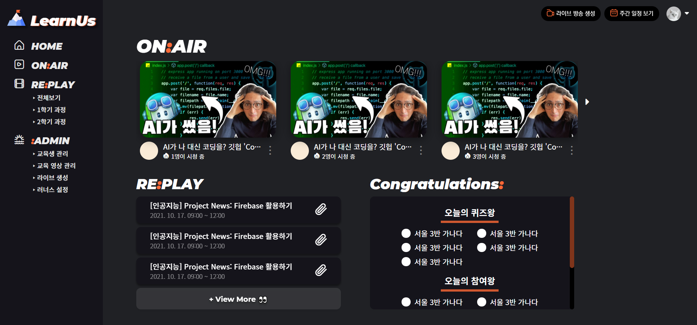
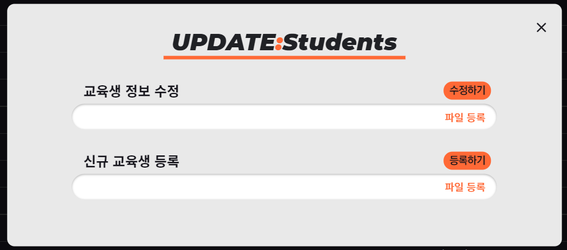
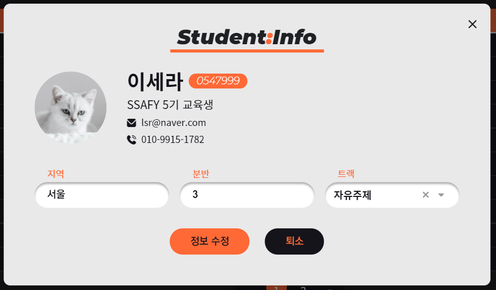
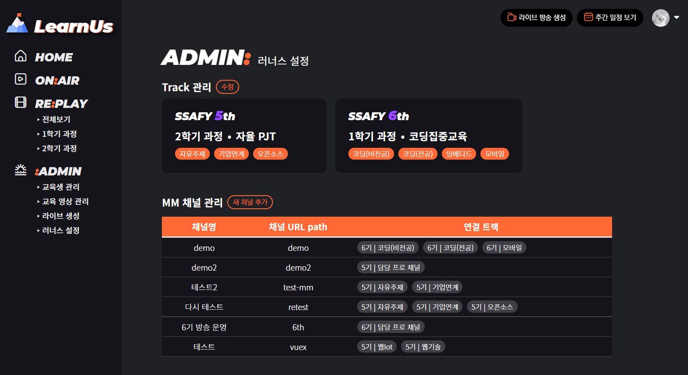
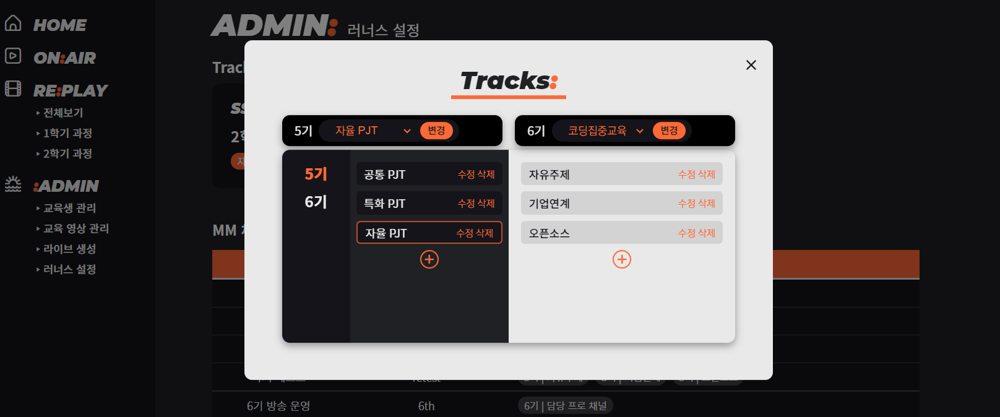
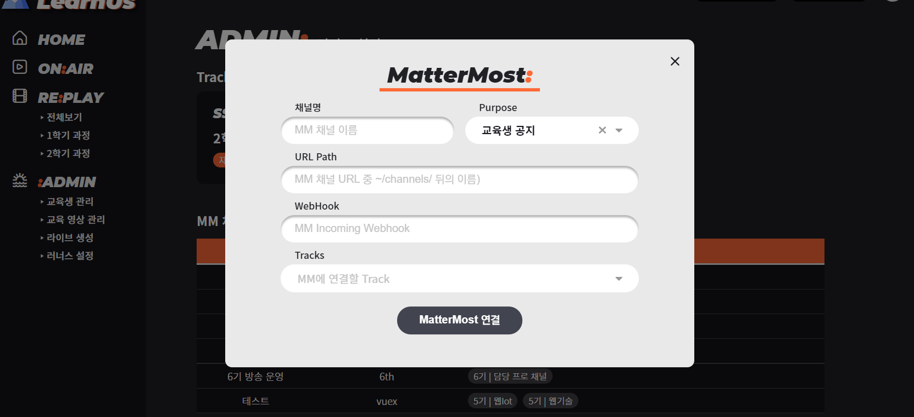
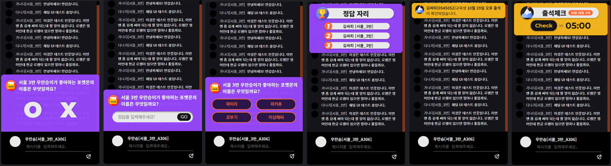
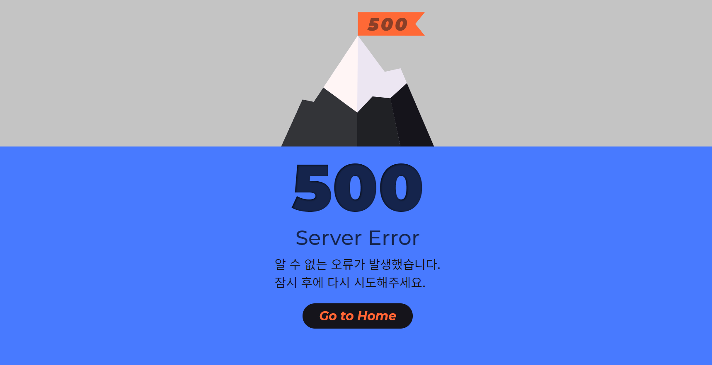

# frontend

## FE 작업 기록 (최신 화면 확인용)

#### INDEX




#### ADMIN/Student







#### ADMIN/SETTINGS





#### 


#### LIVE STUDIO


#### LIVE CHAT




#### Login


#### Error





## Project setup

```
npm install
```

### Compiles and hot-reloads for development
```
npm run serve
```

### Compiles and minifies for production
```
npm run build
```

### Lints and fixes files
```
npm run lint
```

### Customize configuration
See [Configuration Reference](https://cli.vuejs.org/config/).

